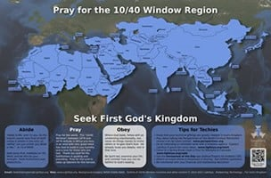
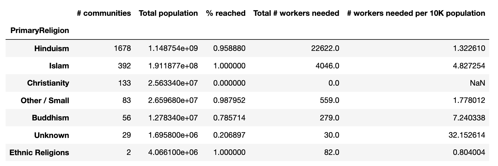
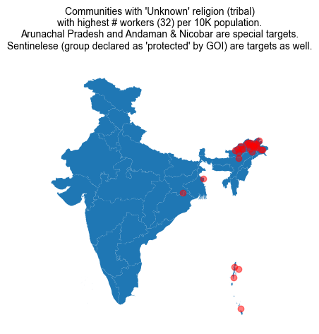
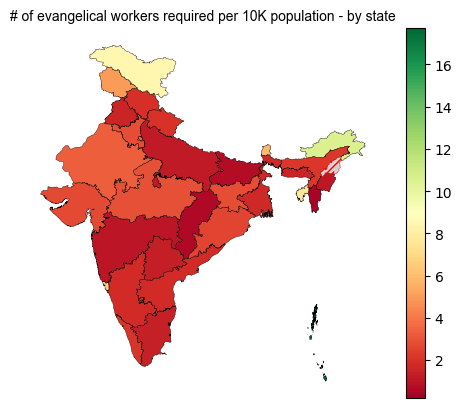

#### || Shree Ganeshay Namah ||

# Joshua Project
----

<i>Analysis on data published by the proselytization organization called Joshua Project</i>

### About Joshua Project
The Joshua Project is a Christian organization based in Colorado Springs, United States, which seeks to coordinate 
the work of missionary organizations to track the ethnic groups of the world with the fewest followers of evangelical 
Christianity. To do so, it maintains ethnologic data to support Christian missions. It also tracks the evangelism 
efforts among 17,446 people groups worldwide—a people group being "the largest group within which the Gospel can 
spread as a church planting movement," according to the project's website — to identify people groups as of yet 
unreached by Christian evangelism[1].

### The 10-40 window
  

"The 10/40 Window is the rectangular area of North Africa, the Middle East and Asia approximately between 10 degrees 
north and 40 degrees north latitude. The 10/40 Window is often called "The Resistant Belt" and includes the majority 
of the world's Muslims, Hindus, and Buddhists. The original 10/40 Window included only countries with at least 50% of 
their land mass within 10 and 40 degrees north latitude. The revised 10/40 Window includes several additional 
countries that are close to 10 or 40 degrees north latitude and have high concentrations of unreached peoples."[2]
 

### How does Joshua Project view India?
According to Joshua Project, India falls in the 

India tops the list of countries in terms of number of target groups: <a href="https://joshuaproject.net/assets/media/handouts/unreached-peoples-overview.pdf">Unreached?</a>

1. Here is a link to the document published by Joshua Project making a case for evangelical activity in India: <a href="https://joshuaproject.net/assets/media/handouts/why-india.pdf">Why India?</a>
2. Here is an infographic that explains the size-of-the-prize for evangelizers: <a href="https://joshuaproject.net/assets/media/handouts/states-of-india-as-countries.pdf"> Size of the prize</a>
3. Here is a document showing the rationale for missionary activity in India: <a href="https://joshuaproject.net/assets/media/handouts/mission-trends-facts.pdf">Rationale</a>
Worth noting in this document is point 2 that describe the rationale for activity in India: "Number of non-believers is growing".

---  
## Data
1. Population data used for the analysis was downloaded from joshuaproject.com. The dataset can be downloaded from 
<a href="https://joshuaproject.net/resources/datasets">here</a>
2. Shapefiles for Indian states and union territories can be downloaded from 
3. <a href="http://projects.datameet.org/maps/states/">here</a> 

----  
## Analysis

### 1. Indigenous communities of the Northeast are at high risk

While more Hindu communities are targeted in general, the evangelical activity is more intense for communities that 
might present themselves as 'lower hanging fruits', e.g. Pashmanda Muslims, Buddhists (Dalit converts). Even other 
Christian sects are calid target groups.

  

As can be seen from this graph, almost all groups with 'Unknown' religion (primarily tribal groups) are high targets of
evangelical activity. Perhaps the most disturbing fact is that even the Sentinelese tribe(s) that has been given a 
'protected' status by the Government of India<a href="https://pib.gov.in/Pressreleaseshare.aspx?PRID=1562728">
[3]</a> have made it to the list. To bring this matter to life, here is an article that shows the conviction of 
the missionaries to this mission - you can read this article 
<a href="https://www.theguardian.com/world/2018/nov/21/american-killed-isolated-indian-tribe-north-sentinel-island">
here</a>.

### 2. Tribal populations are at a great risk of losing their way of life to Jesus
  

Territories such as Arunachal Pradesh, Andaman and Nicobar islands and Ladakh that have large tribal populations making
them target #1 amongst other population groups. Upon conversion, tribals are coerced into segregating themselves from
their 'heathen' counterparts, make attempts to look like the white Westerner and give up markers of local identity. 
<a href="https://www.hinduismtoday.com/magazine/january-february-march-2005/2005-01-fighting-to-preserve-a-tribal-heritage/">
Here</a> is an article that beautifully describes the condition of tribal converts in the Northeast
<a href="https://www.hinduismtoday.com/magazine/january-february-march-2005/2005-01-fighting-to-preserve-a-tribal-heritage/">
[4]</a>.

### More to come..

#### Requests / suggestions
Please re-direct your queries and suggestions to vindicindic@gmail.com.

#### References
1. Shellnutt, Kate. "Missions Experts Are Redefining 'Unreached People Groups'". ChristianityToday.com. Retrieved 2021-03-11.
2. https://joshuaproject.net/resources/articles/10_40_window
3. https://pib.gov.in/Pressreleaseshare.aspx?PRID=1562728
4. https://www.hinduismtoday.com/magazine/january-february-march-2005/2005-01-fighting-to-preserve-a-tribal-heritage/

